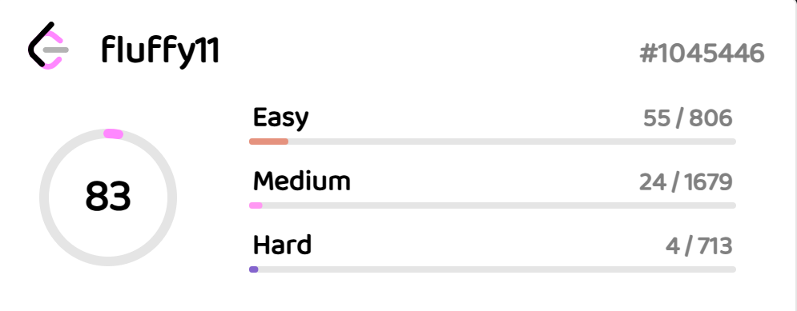

## MY RESUME

- - - 

### Name:

> Matsiushenka Anton
- - - 

### Contacts:

> Minsk, Belarus  
> tg: @fluffy11lol  
> email: d.matsiushenka@gmail.com  
> GitHub: @fluffy11lol
- - -

### About me:

> I have a great interest
> in software development. I am studying
> the direction of Fullstack development.   
> Programming is my passion!
- - - 

### Skills:

> Golang, JavaScript, Git, ASM, LeetCode enjoyer

- - -

### Code Example:

``` go
func reverseBits(num uint32) uint32 {
	var revNum uint32
	for range 32 {
		revNum = revNum*2 + num&1
		num >>= 1
	}
	return revNum
}
```
- - -
### Education:

> BSUIR FCNS Software Engineering 2023-2027
- - -

### Languages:

> English B2 https://cert.efset.org/BeHcC9  
> Russian, Belarusian Native
